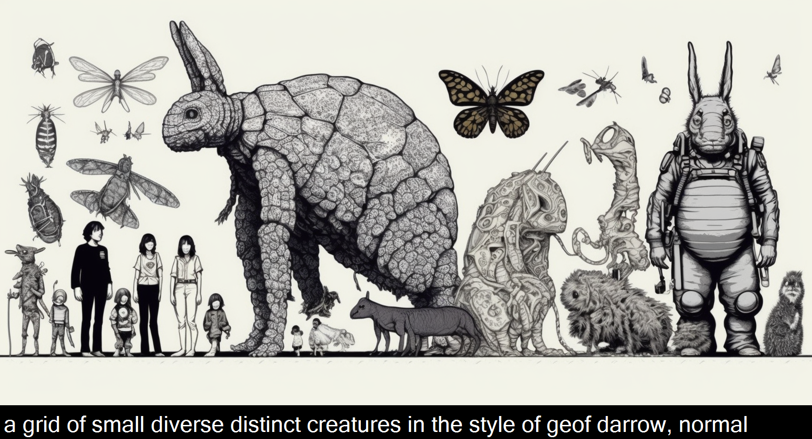

# social-ai

## TLDR; it adds captions to your midjourney images like this:

## What it does

* Downloads and annotates all the images you generate with midjourney
* Also it makes it easy to run "image generation parties"
* It also makes "blend" work better, by creating a new output image which contains the prompt, AND all three images (two inputs + one output) all visible at the same time, so you can compare.

## How it works

* everyone generates images in a channel
* the bot monitors the channel
* the bot downloads and annotates them with the prompt (images work much better w/prompt)
* bot puts them in a folder
* run slideshow software on the folder to continuously cycle through
* there are also commands to clear out older images.

## What it is

* A simple discord bot which you run locally on your computer
* it monitors channels you have invited it into, and downloads and annotates your images with the prompt

## How to use it

* create a discord bot account
* get all the perms
* download this code
* set up configuration files in this code's folder so the code knows its own token, which channels it's enabled in
* run the bot on your computer
* it will listen to the channels, download, and save your / other's images which get posted in the channel

## Why?

* I'm more interested in how it works, and in understanding what other people are doing!
* Many jokes require seeing the connection between the prompt and the output, NOT just the output!
* Also, I am afraid this all may be shut down one day, and I want a copy of what was made during this amazing time!
